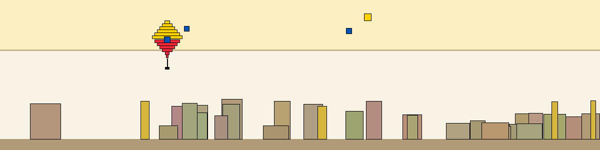

## Hi there! 👋

I'm Marin Nikolli, a passionate Fullstack Developer and Designer from Tirana, Albania. I love blending creativity with technology and am a big fan of Constructivism and Bauhaus.

## Skills & Technologies

[Laravel](https://laravel.com/), [Vue](https://vuejs.org/), [React](https://react.dev/), [Django](https://www.djangoproject.com/), [PHP](https://www.php.net/), [MySQL](https://www.mysql.com/), [Postgress](https://www.postgresql.org/download/), [D3](https://d3js.org/), [Threejs](https://threejs.org/), [MongoDB](https://www.mongodb.com/?msockid=18f41f88c021681c2a650aaac1546995), [Rust](https://www.rust-lang.org/), [Tauri](https://tauri.app/), [CSS](https://css3.com/), [Flutter](https://flutter.dev/), [Quasar](https://quasar.dev/)

## GitHub Stats

🌟 **Public Repos:** 80
🔒 **Private Repos:** 55

## Recent Activity
- Pushed to sibalonat/sibalonat (23 times) on March 01, 2026
- Pushed to sibalonat/cti (9 times) on February 27, 2026
- Pushed to sibalonat/cares (7 times) on February 27, 2026
- Pushed to sibalonat/cti (5 times) on February 26, 2026
## Certifications

- [CS50's Web Programming with
  Python and JavaScript](https://certificates.cs50.io/faf4470c-c773-489d-bc3e-b0086a8a5404.pdf?size=letter) - Issuing Harvard University - Cambridge, Massachusetts, 2025
- [Develop Generative AI Applications: Get Started](https://www.coursera.org/account/accomplishments/verify/LZJGU5D2PMXD?utm_source=link&utm_medium=certificate&utm_content=cert_image&utm_campaign=sharing_cta&utm_product=course) - Online Course offered by COURSERA and authorized by IBM
- [Build RAG Application: Get Started](https://coursera.org/share/0e0e7cc253a9cbcb9643f490762107b6) - Online Course offered by COURSERA and authorized by IBM
- [Vector Databases for RAG: An Introduction](https://www.coursera.org/account/accomplishments/certificate/W1IVVA36A7P6) - Online Course offered by COURSERA and authorized by IBM
- [ISO 27701 - Data Protection and Privacy Information Management](https://alison.com/verify/45850bb1ec) - Online Course offered by Alison
